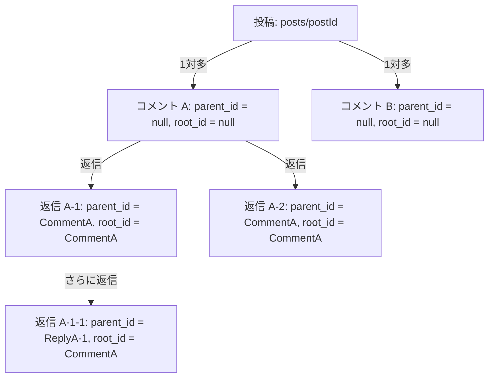

# Firestore データベース操作モジュール説明書

このディレクトリ (`src/firebase/`) は、Firebase Firestore に対するデータのCRUD（作成・読み込み・更新・削除）および各種フィルタリング、暗号化チャット等の連携ロジックをカプセル化したモジュール群です。

型安全性を担保するために TypeScript を使用しており、フロントエンド（React/Next.js コンポーネントおよびAPIルート）から呼び出すことで、Firebase SDK を直接記述することなく安全なデータ操作を行うことができます。

---

## 目次

1. [基本設定モジュール (firebase.ts)](#1-基本設定モジュール-firebasets)
2. [ユーザー情報モジュール (userDb.ts)](#2-ユーザー情報モジュール-userdbts)
3. [投稿モジュール (postDb.ts)](#3-投稿モジュール-postdbts)
4. [コメントモジュール (commentDb.ts)](#4-コメントモジュール-commentdbts)
5. [避難所モジュール (shelterDb.ts)](#5-避難所モジュール-shelterdbts)
6. [災害情報モジュール (disasterDb.ts)](#6-災害情報モジュール-disasterdbts)
7. [いいねモジュール (likeDb.ts)](#7-いいねモジュール-likedbts)
8. [暗号化チャットモジュール (chatDb.ts)](#8-暗号化チャットモジュール-chatdbts)
9. [Q&Aモジュール (qaDb.ts)](#9-qaモジュール-qadbts)
10. [マッチングモジュール (matchDb.ts)](#10-マッチングモジュール-matchdbts)
11. [閲覧履歴モジュール (historyDb.ts)](#11-閲覧履歴モジュール-historydbts)

---

## 1. 基本設定モジュール (`firebase.ts`)
Firebase SDKの初期化と、アプリケーション全体で使用するインスタンスの生成・エクスポートを行います。

### 構成と初期化
- 環境変数 (`NEXT_PUBLIC_FIREBASE_*`) を用いて Firebase クライアントの設定オブジェクトを構築します。
- `getApps().length` を用いて、すでに初期化されている場合は既存のAppインスタンスを取得し、初期化されていない場合のみ `initializeApp(config)` を実行します。（Next.jsのホットリロード時などに重複初期化を防ぐ設計です）

### エクスポートされるオブジェクト
- **`db`** (`Firestore`): Firestoreデータベースへのアクセス用インスタンス。
- **`auth`** (`Auth`): Firebase Authentication用インスタンス。
- **`googleProvider`** (`GoogleAuthProvider`): GoogleアカウントによるOAuth認証プロバイダ。
- **`appleProvider`** (`OAuthProvider`): Apple IDによるOAuth認証プロバイダ (`apple.com`)。
- **`emailProvider`** (`EmailAuthProvider`): メールアドレスとパスワードによる認証プロバイダ。
- **`storage`** (`FirebaseStorage`): プロフィール画像などのファイルを管理する Firebase Storage インスタンス。

---

## 2. ユーザー情報モジュール (`userDb.ts`)
ユーザーのプロフィール情報、登録状況、および住所やプロフィール画像のメタデータを管理します。
Firestore コレクション名: `users` (ドキュメントID = Firebase Authの `uid`)

### データ構造 (`UserProfile` インターフェース)
| プロパティ | 型 | 必須/任意 | 説明 |
| :--- | :--- | :--- | :--- |
| `uid` | `string` | 必須 | ユーザーの固有ID (Firebase AuthのUIDと一致) |
| `userType` | `string` | 任意 | ユーザーの識別種別。以下のリテラル値のいずれか。<br>- `'general'`: 一般ユーザー (市民)<br>- `'politician'`: 議員ユーザー<br>- `'shop'`: 店舗ユーザー |
| `email` | `string` | 必須 | メールアドレス (ログインID。6文字以上30文字以下) |
| `politicalParty` | `string` | 任意 | 所属政党名 (議員ユーザー向け。50文字以内) |
| `pledge` | `string` | 任意 | 掲げる公約や活動方針 (議員ユーザー向け。50文字以上2000文字以内) |
| `shopIntroduction` | `string` | 任意 | 店舗紹介 (店舗ユーザー向け。50文字以上2000文字以内) |
| `shopPhoneNumber` | `string` | 任意 | 店舗電話番号 (店舗ユーザー向け。ハイフンなし半角数字15桁以内) |
| `lastName` | `string` | 任意 | 氏名（苗字 - 漢字など） |
| `firstName` | `string` | 任意 | 氏名（名前 - 漢字など） |
| `lastNameKana` | `string` | 任意 | フリガナ（苗字 - カタカナ） |
| `firstNameKana` | `string` | 任意 | フリガナ（名前 - カタカナ） |
| `nickname` | `string` | 任意 | ニックネーム (アプリ内で公開される表示名) |
| `birthDate` | `string` | 任意 | 生年月日 (YYYY-MM-DD 形式の文字列) |
| `displayName` | `string` | 任意 | 表示用お名前 (議員アカウントの場合は活動名として1〜20文字、店舗アカウントの場合は店舗名として50文字以内で設定) |
| `address` | `object` | 任意 | 現住所情報（議員の活動地域・店舗の所在地としては、郵便番号（ハイフンなし7桁）および住所の登録が必須）。以下の項目でグループ化されています。<br>- `postalCode`: 郵便番号（例: `"1500002"`）<br>- `prefecture`: 都道府県名（例: `"東京都"`）<br>- `addressDetail`: 市区町村・番地（例: `"渋谷区渋谷2-24-12"`）<br>- `buildingName` (任意): 建物名・部屋番号 |
| `profileImage` | `object` | 任意 | プロフィール/店舗画像情報（PNG, JPG, HEIC形式、サイズ4MB以内を想定）。<br>- `url`: Storageに保存されているオリジナル画像のURL<br>- `cropPosition` (任意): クライアント側で画像を丸型フレームに切り抜くための座標パラメータ (`offsetX`, `offsetY`, `zoom`, `displayW`, `displayH` を含むオブジェクトまたは `null`) |
| `isVerified` | `boolean` | 任意 | メールアドレス認証が完了しているかどうかのフラグ |
| `isProfileCompleted` | `boolean` | 任意 | プロフィール詳細登録が完了しているかどうかのフラグ |
| `isRegistered` | `boolean` | 任意 | アカウントの新規登録・本登録フローがすべて完了しているかどうかのフラグ |
| `createdAt` | `string` | 任意 | ドキュメント作成日時 (ISO 8601形式) |
| `updatedAt` | `string` | 任意 | ドキュメント更新日時 (ISO 8601形式) |

### 提供される関数
- **`getUserProfile(uid: string): Promise<UserProfile | null>`**
  - 指定された `uid` に対応する `users` コレクションのドキュメントを取得します。
  - ドキュメントが存在しない場合は `null` を返します。
- **`saveUserProfile(uid: string, profileData: Partial<UserProfile>): Promise<void>`**
  - プロフィール情報を新規保存、または既存ドキュメントにマージします（`setDoc` に `{ merge: true }` オプションを使用するため、渡されていないフィールドは既存のまま保持されます）。
- **`updateUserProfile(uid: string, profileData: Partial<UserProfile>): Promise<void>`**
  - 特定のフィールドのみを直接更新します (`updateDoc` を使用)。

---

## 3. 投稿モジュール (`postDb.ts`)
アプリのタイムラインなどに公開される、ユーザーからの投稿データを管理します。
Firestore コレクション名: `posts`

### データ構造
#### `PostStatus` (ユニオン型)
- `'Public' | 'Private' | 'Draft'` (公開ステータス)

#### `Post` インターフェース
| プロパティ | 型 | 必須/任意 | 説明 |
| :--- | :--- | :--- | :--- |
| `id` | `string` | 任意 | 投稿のドキュメントID (Firestoreから読み込み時に自動付与) |
| `author_uid` | `string` | 必須 | 投稿者のユーザーUID (`users` コレクションへの参照) |
| `user_badge` | `string` | 必須 | 投稿時点のユーザーバッジ (例: 議員バッジなど) |
| `content_text` | `string` | 必須 | 投稿本文 |
| `image_url` | `string \| null` | 任意 | 添付画像のダウンロードURL (任意) |
| `geo_location` | `GeoPoint \| null` | 任意 | 緯度・経度 (`firebase/firestore` の `GeoPoint` 形式) |
| `status` | `PostStatus` | 必須 | 公開ステータス |
| `created_at` | `Timestamp` | 必須 | 投稿日時 |

### 提供される関数
- **`createPost(postData: Omit<Post, 'id' | 'created_at'> & { created_at?: Timestamp }): Promise<string>`**
  - 投稿ドキュメントを新規追加します。
  - `created_at` が未指定の場合、`Timestamp.now()` が自動設定されます。
  - 作成されたドキュメントIDを返します。
- **`getPost(postId: string): Promise<Post | null>`**
  - 指定した投稿IDのドキュメントを1件取得します。
- **`updatePost(postId: string, postData: Partial<Omit<Post, 'id' | 'author_uid'>>): Promise<void>`**
  - 投稿の特定フィールドを部分更新します。安全のため `id` および `author_uid` は更新対象から除外されます。
- **`deletePost(postId: string): Promise<void>`**
  - 投稿ドキュメントを削除します。
- **`getPosts(options?: GetPostsOptions): Promise<Post[]>`**
  - 投稿一覧を取得します。デフォルトは `created_at` の降順 (最新順) です。
  - `GetPostsOptions` により以下のフィルタ・取得制御が可能です。
    - `status` (`PostStatus`): ステータスによる絞り込み。
    - `author_uid` (`string`): 特定のユーザーの投稿に絞り込み。
    - `limitCount` (`number`): 最大取得件数の指定。
    - `startAfterDoc` (`QueryDocumentSnapshot`): ページネーション用の開始点となるスナップショット。

---

## 4. コメントモジュール (`commentDb.ts`)
投稿に対するコメントや、その返信（ツリー状の会話スレッド）を管理します。
Firestore コレクション名: `comments`

### 返信（コメントのコメント）の無限階層設計ポリシー
「コメントに対する返信が無限に増える」要件を、Firestoreで効率的かつ安価に実現するため、ネスト（サブコレクション）を使わない**フラット格納設計**を採用しています。

- **関係性の表現**:
  - `/comments` という単一のコレクションにすべてのコメントを保存します。
  - `parent_id` (直接の返信先コメントID) と `root_id` (スレッド最上位のルートコメントID) を持たせることで、親子・先祖関係を保持します。



### データ構造 (`Comment` インターフェース)
| プロパティ | 型 | 必須/任意 | 説明 |
| :--- | :--- | :--- | :--- |
| `id` | `string` | 任意 | コメントのドキュメントID (Firestoreから読み込み時に自動付与) |
| `post_id` | `string` | 必須 | コメント対象の投稿ID (`posts` 参照) |
| `parent_id` | `string \| null` | 必須 | 直接の返信先コメントのID。最上位（ルート）コメントの場合は `null` |
| `root_id` | `string \| null` | 必須 | 返信スレッド最上位のコメントID。自身が最上位の場合は `null` |
| `author_uid` | `string` | 必須 | コメント投稿者のユーザーUID (`users` 参照) |
| `content_text` | `string` | 必須 | コメント本文 |
| `created_at` | `Timestamp` | 必須 | コメント投稿日時 |

### 提供される関数
- **`createComment(commentData: Omit<Comment, 'id' | 'created_at'> & { created_at?: Timestamp }): Promise<string>`**
  - 新しいコメントを作成します。`created_at` 未設定時はサーバー時間が適用されます。
  - 新規作成したドキュメントIDを返します。
- **`getComment(commentId: string): Promise<Comment | null>`**
  - 指定したコメントIDに対応するコメント情報を1件取得します。
- **`updateComment(commentId: string, commentData: Partial<Omit<Comment, 'id' | 'post_id' | 'author_uid'>>): Promise<void>`**
  - コメント本文などの特定フィールドを更新します (`id`, `post_id`, `author_uid` は除外)。
- **`deleteComment(commentId: string): Promise<void>`**
  - コメントドキュメントを削除します。
- **`getCommentsForPost(postId: string, options?: GetCommentsOptions): Promise<Comment[]>`**
  - 特定の投稿に対するコメント一覧を取得します。デフォルトは時系列昇順（古い順）です。
  - `options.rootOnly` が `true` の場合、返信ではない最上位コメント（`parent_id == null`）のみに限定します。
  - `limitCount` および `startAfterDoc` オプションを用いたページネーションにも対応しています。
- **`getRepliesForComment(commentId: string): Promise<Comment[]>`**
  - 指定したコメントに対して直接返信された1レベル下の子コメント一覧を、時系列昇順で取得します。
- **`getThreadComments(rootCommentId: string): Promise<Comment[]>`**
  - スレッド全体の最上位コメント (`root_id === rootCommentId`) にぶら下がる孫返信などを含めたすべての返信コメントを時系列昇順で一括取得します。クライアント側でスレッド形式の会話をツリー再構築して表示する際に使用します。

---

## 5. 避難所モジュール (`shelterDb.ts`)
地域の避難所の名前や地理的な位置情報を管理します。
Firestore コレクション名: `shelters`

### データ構造 (`Shelter` インターフェース)
| プロパティ | 型 | 必須/任意 | 説明 |
| :--- | :--- | :--- | :--- |
| `id` | `string` | 任意 | 避難所のドキュメントID (Firestoreから読み込み時に自動付与) |
| `shelter_name` | `string` | 必須 | 避難所の名前 |
| `location` | `GeoPoint` | 必須 | 避難所の位置情報 (緯度・経度: `GeoPoint`) |
| `capacity` | `number` | 任意 | 避難所の収容可能人数 |

### 提供される関数
- **`createShelter(shelterData: Omit<Shelter, 'id'>): Promise<string>`**
  - 新しい避難所を追加し、そのドキュメントIDを返します。
- **`getShelter(shelterId: string): Promise<Shelter | null>`**
  - 指定したIDに対応する避難所データを1件取得します。
- **`updateShelter(shelterId: string, shelterData: Partial<Omit<Shelter, 'id'>>): Promise<void>`**
  - 避難所データの一部を更新します。
- **`deleteShelter(shelterId: string): Promise<void>`**
  - 避難所データを削除します。
- **`getShelters(): Promise<Shelter[]>`**
  - 登録されているすべての避難所情報の一覧を取得します。

---

## 6. 災害情報モジュール (`disasterDb.ts`)
洪水、土砂、津波、地震などの災害情報、およびその影響範囲を表すポリゴン（危険区域）データを管理します。
Firestore コレクション名: `disasters`

### データ構造
#### `DisasterType` (ユニオン型)
- `'洪水' | '土砂' | '津波' | '地震'`

#### `DangerZone` インターフェース
GeoJSON の Polygon 構造に準拠した危険エリアデータ。
- `type`: `'Polygon'` (固定)
- `coordinates`: `{ lat: number; lng: number }[]` (ポリゴンの頂点となる緯度・経度の配列)

#### `Disaster` インターフェース
| プロパティ | 型 | 必須/任意 | 説明 |
| :--- | :--- | :--- | :--- |
| `id` | `string` | 任意 | 災害情報のドキュメントID (Firestoreから読み込み時に自動付与) |
| `disaster_type` | `DisasterType` | 必須 | 災害の種別 |
| `seismic_intensity` | `string` | 任意 | 地震の最大震度 (例: `"3"`, `"5弱"`, `"5強"`, `"6強"` など) <br>※`disaster_type` が `'地震'` の場合のみ設定されます。 |
| `seismic_intensity_code` | `number` | 任意 | 地震の最大震度コード (例: `30` (3), `45` (5弱), `50` (5強), `60` (6強) など) <br>※`disaster_type` が `'地震'` の場合のみ設定されます。 |
| `prefecture_intensity` | `Record<string, { scale: number; intensity: string }>` | 任意 | 各都道府県ごとの震度情報。都道府県名をキーとし、その都道府県で観測された最大震度スケール値と震度表記のオブジェクトを格納します。<br>※`disaster_type` が `'地震'` の場合のみ設定されます。 |
| `danger_zone` | `DangerZone` | 必須 | 危険区域のポリゴンデータ。地図上で危険エリアを色付け・描画するために使用します。 |
| `occurred_at` | `Timestamp` | 必須 | 災害発生日時 |
| `created_at` | `Timestamp` | 必須 | レコード作成日時 |

### 提供される関数
- **`createDisaster(disasterData: Omit<Disaster, 'id' | 'created_at'> & { created_at?: Timestamp }): Promise<string>`**
  - 新規の災害情報を追加します。レコード作成日時が省略された場合はサーバー時間がセットされます。
  - 作成されたドキュメントIDを返します。
- **`getDisaster(disasterId: string): Promise<Disaster | null>`**
  - 特定の災害情報を1件取得します。
- **`updateDisaster(disasterId: string, disasterData: Partial<Omit<Disaster, 'id' | 'created_at'>>): Promise<void>`**
  - 指定された災害情報の一部フィールドを更新します。
- **`deleteDisaster(disasterId: string): Promise<void>`**
  - 指定したIDの災害情報を削除します。
- **`getDisasters(): Promise<Disaster[]>`**
  - 登録されている災害情報を、発生日時 (`occurred_at`) の降順で一括取得します。

### 外部API自動連携 (P2P地震情報 API v2 との同期)
地震および津波の発生データについては、気象庁等のデータを配信する「P2P地震情報 API v2」と自動同期する機能がバックエンドルートハンドラー (`app/api/disasters/sync/route.ts`) として実装されています。

1. **同期の契機**:
   - `GET /api/disasters/sync` がリクエストされると動作します。
2. **データの重複防止**:
   - P2P地震情報のイベントIDをそのまま Firestore のドキュメントIDとして使用 (`setDoc` merge: true) し、重複した登録を防ぎます。
3. **震源・影響ポリゴン (`danger_zone`) の自動生成**:
   - **地震**: 震央の緯度・経度を中心とした簡易八角形ポリゴンを作成します。マグニチュード値の大きさに応じて影響半径（ポリゴン頂点のオフセット）が自動的に拡大・縮小されます。
   - **津波**: 津波警報・注意報が発表された沿岸地域（都道府県・海岸）を検出し、そのエリアをカバーするバウンディングボックス（ポリゴン）を自動生成して `danger_zone` に格納します。
4. **震度情報の詳細保存 (地震のみ)**:
   - 震度7から震度1までのスケール値、および都道府県ごとの震度マップ情報が `prefecture_intensity` にパースされて保存されます。

---

## 7. いいねモジュール (`likeDb.ts`)
投稿に対する「いいね（Like）」の関係を管理します。いいねの総数は、投稿オブジェクト自体にカウンターを持たせるのではなく、いいねドキュメントの件数を動的に集計する設計を採用しています。
Firestore コレクション名: `likes`

### 重複防止設計
- ドキュメントIDを `${postId}_${userId}` という一意な規則で構成し、`setDoc` を行うことで、同一ユーザーが同一投稿に対して複数回の「いいね」を重複してデータベースへ登録できないように防いでいます。
- データの集計には Firestore の `getCountFromServer` メソッドを使用しており、ドキュメントの読み込み（Read料金）を消費することなく、高速かつ無料枠を圧迫しない設計となっています。

### データ構造 (`Like` インターフェース)
| プロパティ | 型 | 必須/任意 | 説明 |
| :--- | :--- | :--- | :--- |
| `id` | `string` | 任意 | ドキュメントID (形式: `${postId}_${userId}`) |
| `post_id` | `string` | 必須 | いいね対象の投稿ID |
| `user_id` | `string` | 必須 | いいねしたユーザーのUID |
| `created_at` | `Timestamp` | 必須 | いいねを押した日時 |

### 提供される関数
- **`likePost(postId: string, userId: string): Promise<void>`**
  - 指定されたユーザーから投稿へのいいねを登録します（`${postId}_${userId}` のキーでドキュメントを作成）。
- **`unlikePost(postId: string, userId: string): Promise<void>`**
  - いいねを解除します（ドキュメントを物理削除します）。
- **`hasLikedPost(postId: string, userId: string): Promise<boolean>`**
  - 指定されたユーザーが、特定の投稿に対してすでにいいねをしているかどうかを取得します（ドキュメントが存在するか判定）。
- **`getLikeCountForPost(postId: string): Promise<number>`**
  - 指定した投稿に対するいいねの総数を `getCountFromServer` により取得します。
- **`getLikedPostIdsForUser(userId: string): Promise<string[]>`**
  - 指定したユーザーがこれまでにいいねしたすべての投稿IDを配列で返します。

---

## 8. 暗号化チャットモジュール (`chatDb.ts`)
ユーザー間の1対1メッセージの送受信と、チャットルームごとの履歴を管理します。
Firestore コレクション名: `chat_rooms`
サブコレクション名: `/chat_rooms/{roomId}/messages`

### 暗号化設計ポリシー (ゼロ知識に近いセキュアチャット)
1. **ルーム固有の非公開鍵の動的導出 (Derivation)**
   - チャットルームID（参加ユーザーのUIDをアルファベット順にソートして `uid1_uid2` で作成）と、環境変数で保護された暗号化用ソルト (`NEXT_PUBLIC_CHAT_SALT`）を結合します。
   - ブラウザ・サーバー環境の `Web Crypto API` を用い、一方向ハッシュ (SHA-256) によってルームごとに異なる AES-GCM 32バイト対称鍵 (CryptoKey) を動的に生成します。この鍵自体はデータベースに保存されません。
2. **メッセージ暗号化 (AES-GCM)**
   - メッセージ本文は、動的に生成されたそのルーム専用の鍵によって AES-GCM (12バイトのIVを使用) 方式で暗号化されます。
   - 暗号化済みの文字列 (`encrypted_content`) と初期化ベクトル (`iv`) をBase64形式でFirestoreに保存します。
   - 第三者がデータベースの中身を覗き見しても、メッセージの中身は暗号化されているため解読できません。
3. **管理者閲覧可能設計**
   - サーバーサイドのシステム管理者は、環境変数 `NEXT_PUBLIC_CHAT_SALT` を共有しているため、同じくルームキーを導出して復号し、トラブルシューティングやモデレーションに役立てることができます。

### データ構造
#### `ChatRoom` インターフェース
| プロパティ | 型 | 必須/任意 | 説明 |
| :--- | :--- | :--- | :--- |
| `id` | `string` | 任意 | ルームID (形式: `uid1_uid2` アルファベット昇順) |
| `user_ids` | `string[]` | 必須 | 参加者である2ユーザーのUID配列 (サイズ2) |
| `created_at` | `Timestamp` | 必須 | チャットルームの作成日時 |
| `last_message_at` | `Timestamp` | 必須 | 最終メッセージの送信日時 |
| `last_message_text` | `string` | 任意 | 最終メッセージ本文 (暗号化されたBase64) |
| `last_message_iv` | `string` | 任意 | 最終メッセージ用の初期化ベクトル (Base64) |

#### `ChatMessage` インターフェース
| プロパティ | 型 | 必須/任意 | 説明 |
| :--- | :--- | :--- | :--- |
| `id` | `string` | 任意 | メッセージの個別ID |
| `sender_id` | `string` | 必須 | 送信者のUID (システム送信の場合は `"system"`) |
| `recipient_id` | `string` | 必須 | 受信者のUID (システム送信の場合は `"system"`) |
| `encrypted_content` | `string` | 必須 | 暗号化されたメッセージ本文 (Base64) |
| `iv` | `string` | 必須 | 暗号化に使用した初期化ベクトル (Base64) |
| `created_at` | `Timestamp` | 必須 | メッセージ送信日時 |
| `is_system` | `boolean` | 任意 | システムから送信されたシステムメッセージかどうかのフラグ |

#### `DecryptedChatMessage` インターフェース (復号化後の平文型)
- `id`?: `string`
- `sender_id`: `string`
- `recipient_id`: `string`
- `content_text`: `string` (平文に復号されたメッセージ)
- `created_at`: `Timestamp`
- `is_system`?: `boolean`

### 提供される関数
- **`getOrCreateChatRoom(uid1: string, uid2: string): Promise<string>`**
  - ユーザーAとBの間の一意のチャットルームを取得、存在しない場合は `chat_rooms` にドキュメントを新規作成します。
  - ルームID (`uid1_uid2`) を返します。
- **`sendChatMessage(roomId: string, senderId: string, recipientId: string, text: string): Promise<string>`**
  - 本文を暗号化して `/chat_rooms/{roomId}/messages` サブコレクションに保存し、親ドキュメントの最終メッセージ情報 (`last_message_at`, `last_message_text`, `last_message_iv`) を更新します。
- **`sendSystemNotification(roomId: string, text: string): Promise<string>`**
  - マッチング成立などのイベント通知メッセージを暗号化して保存します。`sender_id` には `"system"` が自動設定され、`is_system` フラグが `true` になります。
- **`getDecryptedMessages(roomId: string): Promise<DecryptedChatMessage[]>`**
  - 指定されたチャットルーム内のすべてのメッセージを取得し、ルームの共通鍵で順次復号し、平文化された配列として返します。
  - ※何らかの要因で復号に失敗したメッセージは `🔒 [復号化に失敗した暗号メッセージ]` という代替テキストで返されます。
- **`getChatRoomsForUser(userId: string): Promise<ChatRoom[]>`**
  - 指定したユーザーが参加しているすべてのチャットルームを、最終メッセージが送信された新しい順 (`last_message_at` 降順) で取得します。

---

## 9. Q&Aモジュール (`qaDb.ts`)
地域別の住民間で質問および回答（スレッド）を作成し、やり取りするための掲示板機能です。
Firestore コレクション名: `qa_questions`
サブコレクション名: `/qa_questions/{questionId}/answers`

### データ構造
#### `QAQuestion` インターフェース
| プロパティ | 型 | 必須/任意 | 説明 |
| :--- | :--- | :--- | :--- |
| `id` | `string` | 任意 | 質問ID (FirestoreドキュメントID) |
| `author_uid` | `string` | 必須 | 質問を投稿したユーザーのUID (`users` 参照) |
| `title` | `string` | 必須 | 質問のタイトル |
| `content_text` | `string` | 必須 | 質問の本文 |
| `prefecture` | `string` | 必須 | 対象とする都道府県・地域名（例: `"東京都"`） |
| `created_at` | `Timestamp` | 必須 | 質問作成日時 |
| `updated_at` | `Timestamp` | 任意 | 質問編集日時 |

#### `QAAnswer` インターフェース
| プロパティ | 型 | 必須/任意 | 説明 |
| :--- | :--- | :--- | :--- |
| `id` | `string` | 任意 | 回答ID (サブコレクションのドキュメントID) |
| `question_id` | `string` | 必須 | 紐づく親の質問ID |
| `author_uid` | `string` | 必須 | 回答を投稿したユーザーのUID (`users` 参照) |
| `content_text` | `string` | 必須 | 回答の本文 |
| `created_at` | `Timestamp` | 必須 | 回答作成日時 |
| `updated_at` | `Timestamp` | 任意 | 回答編集日時 |

### 提供される関数
- **`createQAQuestion(questionData: Omit<QAQuestion, 'id' | 'created_at'>): Promise<string>`**
  - 新しい質問を作成します。作成された質問のドキュメントIDを返します。
- **`getQAQuestion(questionId: string): Promise<QAQuestion | null>`**
  - 指定された質問IDのドキュメントを1件取得します。
- **`updateQAQuestion(questionId: string, updates: Partial<Pick<QAQuestion, 'title' | 'content_text' | 'prefecture'>>): Promise<void>`**
  - 質問のタイトル・本文・都道府県を変更します。更新時、`updated_at` が自動でセットされます。
- **`deleteQAQuestion(questionId: string): Promise<void>`**
  - 指定された質問を削除します。
- **`getQAQuestions(options?: GetQAQuestionsOptions): Promise<QAQuestion[]>`**
  - 質問の一覧を `created_at` の降順 (最新順) で取得します。
  - `options.prefecture` を指定することで、特定の都道府県に関する質問のみに絞り込めます。
  - `limitCount` や `startAfterDoc` によるページネーションに対応しています。
- **`createQAAnswer(questionId: string, answerData: Omit<QAAnswer, 'id' | 'question_id' | 'created_at'>): Promise<string>`**
  - 質問に対する回答を `/qa_questions/{questionId}/answers` サブコレクションに保存します。
- **`getQAAnswersForQuestion(questionId: string): Promise<QAAnswer[]>`**
  - 該当の質問に対する回答の一覧を、時系列昇順（古い順）で取得します。
- **`updateQAAnswer(questionId: string, answerId: string, contentText: string): Promise<void>`**
  - 回答本文を編集します。`updated_at` が自動設定されます。
- **`deleteQAAnswer(questionId: string, answerId: string): Promise<void>`**
  - 指定された回答をサブコレクションから削除します。

---

## 10. マッチングモジュール (`matchDb.ts`)
一般ユーザーと登録されている議員のアカウント間におけるマッチング関係を処理します。
Firestore コレクション名: `matches` (ドキュメントID = `${user_uid}_${politician_uid}`)

### マッチングおよびチャット開始のフロー
1. **キーの設計**:
   - `matches` のドキュメントIDは `${user_uid}_${politician_uid}` という固定フォーマットによって重複を完全に排除しています。
2. **プロセスの遷移**:
   - どちらか一方が「いいね（`like`）」をアクションした際、ドキュメントが `status: 'pending'` にて作成（またはマージ）されます。
   - 双方が「いいね」を押した状態（`user_action === 'like' && politician_action === 'like'`）になると、自動的にステータスが `'matched'` に更新され、マッチング成立日時 (`matched_at`) が記録されます。
3. **自動チャットルーム作成**:
   - マッチング成立と同時に、`chatDb` の `getOrCreateChatRoom` が内部で自動呼び出しされ、一意のチャットルームが作成されます。さらに、`"マッチングが成立しました！チャットを開始できます。"` というシステム通知メッセージが暗号化されてチャットログに自動送信されます。
4. **不成立 (BAD) 時の物理削除**:
   - 一方が「BAD (`bad`)」のアクションを選択した場合は、マッチング不成立となり、`deleteDoc` によってドキュメント自体が即時物理削除されます。

### データ構造 (`Match` インターフェース)
| プロパティ | 型 | 必須/任意 | 説明 |
| :--- | :--- | :--- | :--- |
| `id` | `string` | 任意 | ドキュメントID (形式: `user_uid_politician_uid`) |
| `user_uid` | `string` | 必須 | 一般ユーザーのUID |
| `politician_uid` | `string` | 必須 | 議員ユーザーのUID |
| `user_action` | `'like' \| 'bad' \| 'none'` | 必須 | 一般ユーザーのアクション状況 |
| `politician_action` | `'like' \| 'bad' \| 'none'` | 必須 | 議員ユーザーのアクション状況 |
| `status` | `'pending' \| 'matched'` | 必須 | マッチングステータス |
| `matched_at` | `Timestamp` | 任意 | マッチング成立日時 (双方が「いいね」した時のみ格納) |
| `created_at` | `Timestamp` | 必須 | ドキュメント作成日時 |
| `updated_at` | `Timestamp` | 必須 | ドキュメント更新日時 |

### 提供される関数
- **`handleUserLike(userUid: string, politicianUid: string): Promise<{ status: 'pending' \| 'matched'; roomId?: string }>`**
  - 一般ユーザーが議員に対して「いいね」を送信します。マッチングが成立した場合は `'matched'` ステータスと自動作成された `roomId` を返します。
- **`handlePoliticianLike(politicianUid: string, userUid: string): Promise<{ status: 'pending' \| 'matched'; roomId?: string }>`**
  - 議員が一般ユーザーに対して「いいね」を送信します。同様にマッチング成立判定を行います。
- **`handleUserBad(userUid: string, politicianUid: string): Promise<void>`**
  - 一般ユーザーが「BAD」を選択した際の処理。ドキュメントを物理削除します。
- **`handlePoliticianBad(politicianUid: string, userUid: string): Promise<void>`**
  - 議員が「BAD」を選択した際の処理。ドキュメントを物理削除します。
- **`getMatchesForUser(userUid: string, status?: 'pending' \| 'matched'): Promise<Match[]>`**
  - 特定の一般ユーザーに関わるマッチング一覧を取得します (ステータスによる絞り込みが可能)。
- **`getMatchesForPolitician(politicianUid: string, status?: 'pending' \| 'matched'): Promise<Match[]>`**
  - 特定の議員に関わるマッチング一覧を取得します (ステータスによる絞り込みが可能)。

---

## 11. 閲覧履歴モジュール (`historyDb.ts`)
投稿を詳細表示した際のユーザーの閲覧履歴（履歴データ）を管理します。
Firestore コレクション名: `view_histories`

### 重複防止およびインデックス不要設計
- ドキュメントIDを `${postId}_${userId}` の規則で作成して `setDoc` を実行します。これにより、同じユーザーが同じ投稿を複数回閲覧した場合も、`viewed_at` が最新のタイムスタンプに更新され、履歴が重複しません。
- データの取得時は Firestore 側で `user_id` でのみ絞り込み、取得後にクライアント側で降順ソートします。これにより複合インデックスが不要になり、Firestore上での追加設定なしで安定して動作します。

### データ構造 (`ViewHistory` インターフェース)
| プロパティ | 型 | 必須/任意 | 説明 |
| :--- | :--- | :--- | :--- |
| `id` | `string` | 任意 | ドキュメントID (形式: `${postId}_${userId}`) |
| `post_id` | `string` | 必須 | 閲覧対象の投稿ID |
| `user_id` | `string` | 必須 | 閲覧したユーザーのUID |
| `viewed_at` | `Timestamp` | 必須 | 閲覧した日時（タイムスタンプ） |

### 提供される関数
- **`recordViewHistory(postId: string, userId: string): Promise<void>`**
  - 投稿の閲覧履歴を書き込み、または更新します。
- **`getViewHistoryForUser(userId: string): Promise<ViewHistory[]>`**
  - 特定のユーザーの閲覧履歴一覧を取得します。

---

## Firestore セキュリティルール設計の推奨事項
これらのモジュールがクライアント側から直接呼び出される場合、以下のFirestoreルールが想定されています。

```javascript
rules_version = '2';
service cloud.firestore {
  match /databases/{database}/documents {
    
    // 1. users
    match /users/{uid} {
      allow read: if request.auth != null;
      allow write: if request.auth != null && request.auth.uid == uid;
    }
    
    // 2. posts
    match /posts/{postId} {
      allow read: if request.auth != null;
      allow create: if request.auth != null && request.resource.data.author_uid == request.auth.uid;
      allow update, delete: if request.auth != null && resource.data.author_uid == request.auth.uid;
    }
    
    // 3. comments
    match /comments/{commentId} {
      allow read: if request.auth != null;
      allow create: if request.auth != null && request.resource.data.author_uid == request.auth.uid;
      allow update, delete: if request.auth != null && resource.data.author_uid == request.auth.uid;
    }
    
    // 4. shelters
    match /shelters/{shelterId} {
      allow read: if request.auth != null;
      allow write: if request.auth != null && get(/databases/$(database)/documents/users/$(request.auth.uid)).data.isAdmin == true;
    }
    
    // 5. disasters
    match /disasters/{disasterId} {
      allow read: if request.auth != null;
      allow write: if request.auth != null && get(/databases/$(database)/documents/users/$(request.auth.uid)).data.isAdmin == true;
    }
    
    // 6. likes
    match /likes/{likeId} {
      allow read: if request.auth != null;
      // likeId = postId_userId の形式のため、自分自身のuserIdでのみ作成・削除を許可
      allow create: if request.auth != null && request.resource.data.user_id == request.auth.uid && likeId == request.resource.data.post_id + '_' + request.auth.uid;
      allow delete: if request.auth != null && resource.data.user_id == request.auth.uid;
    }
    
    // 7. chat_rooms & messages
    match /chat_rooms/{roomId} {
      allow read, write: if request.auth != null && (
        request.auth.uid in resource.data.user_ids ||
        request.auth.uid in request.resource.data.user_ids ||
        get(/databases/$(database)/documents/users/$(request.auth.uid)).data.isAdmin == true
      );

      match /messages/{messageId} {
        allow read: if request.auth != null && (
          request.auth.uid in get(/databases/$(database)/documents/chat_rooms/$(roomId)).data.user_ids ||
          get(/databases/$(database)/documents/users/$(request.auth.uid)).data.isAdmin == true
        );
        allow write: if request.auth != null && (
          request.auth.uid == request.resource.data.sender_id ||
          get(/databases/$(database)/documents/users/$(request.auth.uid)).data.isAdmin == true
        );
      }
    }
    
    // 8. qa_questions & answers
    match /qa_questions/{questionId} {
      allow read: if request.auth != null;
      allow create: if request.auth != null && request.resource.data.author_uid == request.auth.uid;
      allow update, delete: if request.auth != null && (
        resource.data.author_uid == request.auth.uid ||
        get(/databases/$(database)/documents/users/$(request.auth.uid)).data.isAdmin == true
      );

      match /answers/{answerId} {
        allow read: if request.auth != null;
        allow create: if request.auth != null && request.resource.data.author_uid == request.auth.uid;
        allow update, delete: if request.auth != null && (
          resource.data.author_uid == request.auth.uid ||
          get(/databases/$(database)/documents/users/$(request.auth.uid)).data.isAdmin == true
        );
      }
    }
    
    // 9. matches
    match /matches/{matchId} {
      allow read: if request.auth != null && (
        request.auth.uid == resource.data.user_uid ||
        request.auth.uid == resource.data.politician_uid ||
        get(/databases/$(database)/documents/users/$(request.auth.uid)).data.isAdmin == true
      );
      allow create: if request.auth != null && (
        request.auth.uid == request.resource.data.user_uid ||
        request.auth.uid == request.resource.data.politician_uid
      );
      allow update, delete: if request.auth != null && (
        request.auth.uid == resource.data.user_uid ||
        request.auth.uid == resource.data.politician_uid ||
        get(/databases/$(database)/documents/users/$(request.auth.uid)).data.isAdmin == true
      );
    }
    
    // 10. view_histories
    match /view_histories/{historyId} {
      allow read: if request.auth != null && resource.data.user_id == request.auth.uid;
      // historyId = postId_userId の形式のため、自分自身のuserIdでのみ作成・更新・削除を許可
      allow create, update: if request.auth != null && request.resource.data.user_id == request.auth.uid && historyId == request.resource.data.post_id + '_' + request.auth.uid;
      allow delete: if request.auth != null && resource.data.user_id == request.auth.uid;
    }
  }
}
```