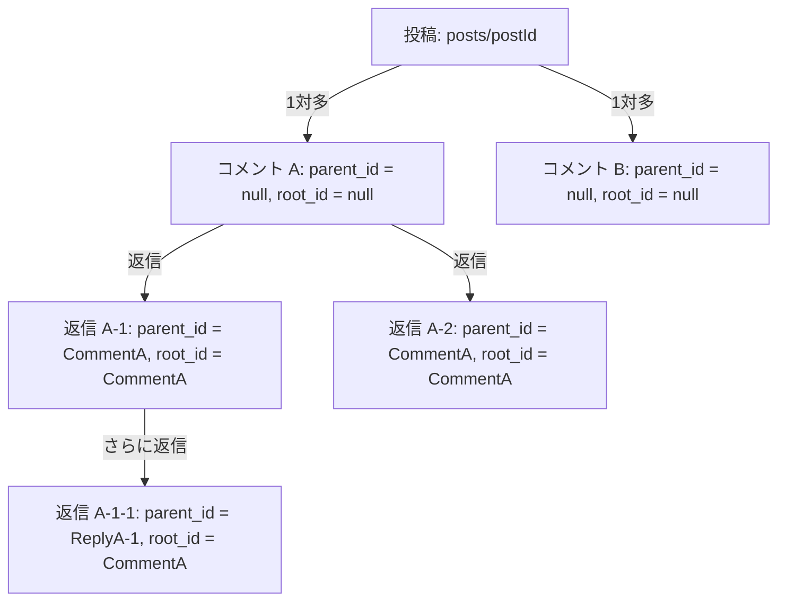

# Firestore データベース操作モジュール説明書

このディレクトリは、Firebase Firestore に対するデータの作成・読み込み・更新・削除（CRUD）およびフィルタリング一覧取得などを安全に行うためのデータベース連携レイヤーです。

型安全性を担保するために TypeScript を使用しており、UIコンポーネント側からはこれらの非同期関数を呼び出すだけで安全にデータベース連携を行うことができます。

---

## 1. ユーザー情報モジュール (`userDb.ts`)
ユーザーのプロフィール情報や登録ステータスを管理します。

### データ構造 (`UserProfile` インターフェース)
- `uid`: `string` (Firebase AuthのUIDと一致します)
- `email`: `string` (メールアドレス)
- `lastName` / `firstName`?: `string` (氏名 - 漢字)
- `lastNameKana` / `firstNameKana`?: `string` (フリガナ)
- `nickname`?: `string` (表示名)
- `birthDate`?: `string` (生年月日)
- `address`?: `object` (住所情報: 郵便番号・都道府県・市区町村・建物名など)
- `profileImage`?: `object` (画像URLおよび丸型切り抜き座標パラメータ)
- `isVerified` / `isProfileCompleted` / `isRegistered`?: `boolean` (認証・登録ステータス)
- `createdAt` / `updatedAt`?: `string` (ISO形式の日時文字列)

### 提供される関数
- **`getUserProfile(uid)`**: ユーザーIDからプロフィールを取得。
- **`saveUserProfile(uid, profileData)`**: 新規保存またはマージ保存（`setDoc` merge: true）。
- **`updateUserProfile(uid, profileData)`**: 特定のフィールドのみを部分更新（`updateDoc`）。

---

## 2. 投稿モジュール (`postDb.ts`)
アプリ内の投稿データを管理します。

### データ構造 (`Post` インターフェース)
- `id`?: `string` (ドキュメントID。取得時に自動で付与されます)
- `author_uid`: `string` (投稿者ユーザーID)
- `user_badge`: `string` (投稿時点のユーザーバッジ)
- `content_text`: `string` (投稿本文)
- `image_url`?: `string | null` (添付画像のダウンロードURL。1投稿につき最大1枚)
- `geo_location`?: `GeoPoint | null` (緯度・経度)
- `status`: `'Public' | 'Private' | 'Draft'` (公開ステータス)
- `created_at`: `Timestamp` (投稿日時)

### 提供される関数
- **`createPost(postData)`**: 投稿を新規作成（`created_at` は自動初期化可能）。
- **`getPost(postId)`**: 特定の投稿ドキュメントを1件取得。
- **`updatePost(postId, postData)`**: 投稿内容の部分更新（IDや投稿者IDは書き換え不可）。
- **`deletePost(postId)`**: 投稿ドキュメントの削除。
- **`getPosts(options)`**: 投稿一覧を最新順（`created_at` 降順）で取得。公開ステータスや投稿者によるフィルタ、表示件数制限（limit）、およびページネーション用スナップショット指定（startAfter）に対応。

---

## 3. コメントモジュール (`commentDb.ts`)
投稿に対するコメント、およびコメントへの返信スレッドを管理します。

### 返信（コメントのコメント）の無限階層設計ポリシー
「コメントに対するコメント（返信）が無限に増える」要件を、Firestoreで効率的かつ安価に実現するため、ネスト（サブコレクション）を使わない**フラット格納設計**を採用しています。

- **関係性の表現**:
  - `/comments` という単一のコレクションにすべてのコメントを保存します。
  - `parent_id` (直接の返信先コメントID) と `root_id` (スレッド最上位のルートコメントID) を持たせることで、親子・先祖関係を保持します。



### データ構造 (`Comment` インターフェース)
- `id`?: `string` (ドキュメントID)
- `post_id`: `string` (対象の投稿ID)
- `parent_id`: `string | null` (親コメントのID。ルートコメントの場合は `null`)
- `root_id`: `string | null` (返信スレッド最上位のコメントのID。自身が最上位の場合は `null`)
- `author_uid`: `string` (コメント投稿者のユーザーID)
- `content_text`: `string` (コメント本文)
- `created_at`: `Timestamp` (コメント日時)

### 提供される関数
- **`createComment(commentData)`**: コメントの新規作成。
- **`getComment(commentId)`**: コメントを1件取得。
- **`updateComment(commentId, commentData)`**: コメントの部分更新（本文の編集など）。
- **`deleteComment(commentId)`**: コメントの削除。
- **`getCommentsForPost(postId, options)`**: 特定の投稿に対するコメント一覧を取得（ルートコメントのみに絞る `rootOnly` オプションやページネーションに対応）。
- **`getRepliesForComment(commentId)`**: 特定のコメントに対する直接の返信（1段階下のコメント）一覧を古い順（時系列）で取得。
- **`getThreadComments(rootCommentId)`**: 特定のスレッド全体（孫返信を含むすべての子コメント）を古い順（時系列）で一括取得。フロントエンド側でツリー表示する際に非常に便利です。

---

## 4. 避難所モジュール (`shelterDb.ts`)
避難所情報（避難所名、位置情報、収容可能人数など）を管理します。

### データ構造 (`Shelter` インターフェース)
- `id`?: `string` (ドキュメントID。取得時に自動で付与されます)
- `shelter_name`: `string` (避難所名)
- `location`: `GeoPoint` (避難所の位置情報)
- `capacity`?: `number` (収容可能人数。任意)

### 提供される関数
- **`createShelter(shelterData)`**: 避難所情報を新規登録します。
- **`getShelter(shelterId)`**: 指定した避難所IDに対応する避難所情報を1件取得します。
- **`updateShelter(shelterId, shelterData)`**: 指定した避難所情報の特定フィールドのみを部分更新します。
- **`deleteShelter(shelterId)`**: 指定した避難所IDに対応する避難所を削除します。
- **`getShelters()`**: 避難所の一覧を取得します。

---

## 5. 災害情報モジュール (`disasterDb.ts`)
災害情報（災害種別、危険区域のポリゴンデータ、発生日時など）を管理します。

### データ構造 (`Disaster` インターフェース)
- `id`?: `string` (ドキュメントID。取得時に自動で付与されます)
- `disaster_type`: `DisasterType` (災害種別: '洪水' | '土砂' | '津波' | '地震')
- `danger_zone`: `DangerZone` (危険区域のポリゴンデータ - `{ lat: number, lng: number }[]` 形式の頂点リスト)
- `occurred_at`: `Timestamp` (災害発生日時)
- `created_at`: `Timestamp` (レコード作成日時)

### 提供される関数
- **`createDisaster(disasterData)`**: 災害情報を新規作成します。
- **`getDisaster(disasterId)`**: 指定した災害情報IDに対応する災害情報を1件取得します。
- **`updateDisaster(disasterId, disasterData)`**: 災害情報の特定フィールドのみを部分更新します。
- **`deleteDisaster(disasterId)`**: 指定した災害情報IDに対応する災害情報を削除します。
- **`getDisasters()`**: 災害情報の一覧を発生日時（`occurred_at` 降順）で取得します。

### 外部API自動連携 (P2P地震情報)
地震・津波情報については、外部の「P2P地震情報 API v2」と連携して自動登録・更新を行うルートハンドラーが用意されています。

- **連携エンドポイント**: `/api/disasters/sync` (GETメソッド)
- **自動登録ロジックの概要**:
  1. APIの `/history` エンドポイントから地震情報 (コード 551) および津波予報 (コード 552) の最新10件を取得します。
  2. 重複登録を防ぐため、APIが提供する一意のイベントID (`id`) をそのまま Firestore のドキュメントIDとして使用して `setDoc`（merge: true）で保存します。
  3. **地震データ**: 震央の緯度・経度を中心とした簡易八角形ポリゴンを作成し `danger_zone` に設定します。ポリゴンのサイズ（影響半径）はマグニチュード値によって動的に拡大・縮小されます。
  4. **津波データ**: 注意報・警報が発令された沿岸地域名を日本の主要な都道府県・沿岸代表座標にマッピングし、全対象エリアを包み込むバウンディングボックスを `danger_zone` ポリゴンとして自動生成します。
  5. 災害発生・発表日時 (`occurred_at`) やデータの作成日時 (`created_at`) は、Firestoreの `Timestamp` 形式に変換した上で保存されます。

---

## 6. いいねモジュール (`likeDb.ts`)
投稿に対する「いいね」のレコードを独立したテーブル（コレクション）として管理します。いいね数は投稿ドキュメント内に持たせず、このテーブルのレコード件数（`getCountFromServer`）を基準にカウントします。

### データ構造 (`Like` インターフェース)
- `id`?: `string` (ドキュメントID。形式は `${postId}_${userId}` となり、Firestore側での重複登録を自動で防ぎます)
- `post_id`: `string` (対象の投稿ID)
- `user_id`: `string` (いいねしたユーザーのID)
- `created_at`: `Timestamp` (いいねした日時)

### 提供される関数
- **`likePost(postId, userId)`**: 特定の投稿に対して、いいねを登録します（重複不可）。
- **`unlikePost(postId, userId)`**: 特定の投稿に対するいいねを解除（ドキュメント削除）します。
- **`hasLikedPost(postId, userId)`**: 指定したユーザーが特定の投稿にいいねしているかを判定します。
- **`getLikeCountForPost(postId)`**: 特定の投稿に対するいいねの総数を、`likes` テーブルのレコード数から取得します（`getCountFromServer` を使用して安価かつ高速に取得します）。
- **`getLikedPostIdsForUser(userId)`**: 特定のユーザーがいいねした投稿IDの一覧を取得します。

---

## 7. 暗号化チャットモジュール (`chatDb.ts`)
1対1の非公開チャットルームおよび暗号化されたメッセージを管理します。メッセージはルーム固有の非公開共通鍵（AES-GCM）で暗号化して保存され、Firestoreのセキュリティルールによって当事者および管理者（Admin）のみがデータにアクセス可能です。

### 暗号化設計ポリシー
1. **非公開鍵の動的生成 (鍵導出)**
   - チャットルームID（`uid1_uid2` アルファベット順）とシステムソルト（`NEXT_PUBLIC_CHAT_SALT`）を組み合わせて、一方向ハッシュ関数 (SHA-256) によりルーム固有の非公開共通鍵（CryptoKey）を動的に導出（Derive）します。
   - 鍵はデータベース上に平文保存されないため、システム管理者以外がFirestoreを直接覗き見しても本文を読むことはできません。
2. **メッセージ暗号化 (AES-GCM)**
   - Web Crypto API を利用し、メッセージ本文を安全な対称暗号アルゴリズム（AES-GCM, 12バイトのIVを使用）で暗号化します。
   - 暗号化したメッセージ (`encrypted_content`) と初期化ベクトル (`iv`) をBase64形式でデータベースへ保存します。
3. **管理者閲覧可能設計**
   - サーバー上の管理者（システム管理者）はシステムソルトを知っているため、該当ルームの非公開鍵を同様に導出してメッセージを復号（閲覧）することが可能です。

### データ構造
#### `ChatRoom` インターフェース
- `id`?: `string` (ルームID。形式: `uid1_uid2` アルファベット昇順)
- `user_ids`: `string[]` (参加ユーザー2名のUID配列)
- `created_at`: `Timestamp` (ルーム作成日時)
- `last_message_at`: `Timestamp` (最後のメッセージ送信日時)
- `last_message_text`?: `string` (最後のメッセージ本文・暗号化)
- `last_message_iv`?: `string` (最後のメッセージ用 IV)

#### `ChatMessage` インターフェース
- `id`?: `string` (メッセージID)
- `sender_id`: `string` (送信者UID。システム通知の場合は `"system"`)
- `recipient_id`: `string` (受信者UID。システム通知の場合は `"system"`)
- `encrypted_content`: `string` (暗号化された本文。Base64)
- `iv`: `string` (初期化ベクトル。Base64)
- `created_at`: `Timestamp` (送信日時)
- `is_system`?: `boolean` (システム通知メッセージかどうかのフラグ)

### 提供される関数
- **`getOrCreateChatRoom(uid1, uid2)`**: 二人のユーザーIDから一意のルームIDを検索、無ければ自動で新規ルームを作成します。
- **`sendChatMessage(roomId, senderId, recipientId, text)`**: メッセージをルーム非公開鍵で暗号化した上で `/chat_rooms/{roomId}/messages` に保存し、ルームの最新情報を更新します。
- **`sendSystemNotification(roomId, text)`**: システム通知をルーム非公開鍵で暗号化した上で `/chat_rooms/{roomId}/messages` に保存します（`sender_id` は `"system"`、`is_system` は `true`）。
- **`getDecryptedMessages(roomId)`**: 特定ルームの全メッセージを時系列順に取得し、非公開鍵で自動的に復号（平文化）して返します。
- **`getChatRoomsForUser(userId)`**: 特定のユーザーが参加しているアクティブなチャットルーム一覧を、最終メッセージ送信日時の新しい順に取得します。

### セキュリティルール設計（当事者制限・管理者制限）
Firestoreセキュリティルールを用いて、チャットルームおよびメッセージに対する読み書きを「当事者の2名」または「管理者ロール (`isAdmin == true` など)」のみに制限します。
※ システムメッセージ（`sender_id: "system"`）をルーム参加者が取得できるように、個別メッセージの `read` 権限は親ルームの `user_ids` に含まれるメンバー全員に許可することを推奨します。

```javascript
match /chat_rooms/{roomId} {
  allow read, write: if request.auth != null && (
    request.auth.uid in resource.data.user_ids ||
    request.auth.uid in request.resource.data.user_ids ||
    get(/databases/$(database)/documents/users/$(request.auth.uid)).data.isAdmin == true
  );

  match /messages/{messageId} {
    // 書き込みは当事者（または管理システム）のみ。
    // 読み込みは親チャットルームの参加者全員または管理者ロールに許可することで、システム通知も取得可能にします。
    allow read: if request.auth != null && (
      request.auth.uid in get(/databases/$(database)/documents/chat_rooms/$(roomId)).data.user_ids ||
      get(/databases/$(database)/documents/users/$(request.auth.uid)).data.isAdmin == true
    );
    allow write: if request.auth != null && (
      request.auth.uid == request.resource.data.sender_id ||
      get(/databases/$(database)/documents/users/$(request.auth.uid)).data.isAdmin == true
    );
  }
}
```

---

## 8. Q&A モジュール (`qaDb.ts`)
アプリ内の地域別（住まい別）Q&A（質問と回答）データを管理します。
住んでいる地域にかかわらず、誰でも自由にQ&Aを閲覧し、参加（質問の投稿・回答の投稿）することができます。

### データ構造
#### `QAQuestion` インターフェース
- `id`?: `string` (質問のドキュメントID。自動付与されます)
- `author_uid`: `string` (質問作成者のユーザーID)
- `title`: `string` (質問タイトル)
- `content_text`: `string` (質問本文)
- `prefecture`: `string` (対象の地域/都道府県。例: "東京都")
- `created_at`: `Timestamp` (投稿日時)
- `updated_at`?: `Timestamp` (更新日時)

#### `QAAnswer` インターフェース
- `id`?: `string` (回答のドキュメントID。自動付与されます)
- `question_id`: `string` (親の質問ID)
- `author_uid`: `string` (回答作成者のユーザーID)
- `content_text`: `string` (回答本文)
- `created_at`: `Timestamp` (回答日時)
- `updated_at`?: `Timestamp` (更新日時)

### 提供される関数
- **`createQAQuestion(questionData)`**: 質問を新規投稿します。
- **`getQAQuestion(questionId)`**: 特定の質問ドキュメントを1件取得します。
- **`updateQAQuestion(questionId, updates)`**: 自分の質問を編集（タイトル、本文、地域等）します。
- **`deleteQAQuestion(questionId)`**: 質問ドキュメントを削除します。
- **`getQAQuestions(options)`**: 質問の一覧を最新順（`created_at` 降順）で取得します。特定の `prefecture` でフィルタリングしたり、件数制限やページネーション（`startAfterDoc`）にも対応しています。
- **`createQAAnswer(questionId, answerData)`**: 指定した質問に対する回答を投稿します（`/qa_questions/{questionId}/answers` サブコレクションに保存されます）。
- **`getQAAnswersForQuestion(questionId)`**: 質問に対する全回答を時系列（作成日時の古い順）で取得します。
- **`updateQAAnswer(questionId, answerId, contentText)`**: 回答を編集します。
- **`deleteQAAnswer(questionId, answerId)`**: 回答を削除します。

### セキュリティルール設計（地域制限なしの参加）
地域にかかわらず誰でも参加できるようにするため、Firestoreのセキュリティルールでは認証済みのすべてのユーザーに読み書きを許可し、更新や削除は投稿者本人（または管理者）のみに制限します。

```javascript
match /qa_questions/{questionId} {
  // 読み取り、作成はすべての認証済みユーザーに許可
  allow read: if request.auth != null;
  allow create: if request.auth != null && request.resource.data.author_uid == request.auth.uid;
  // 更新、削除は質問者本人または管理者のみ
  allow update, delete: if request.auth != null && (
    resource.data.author_uid == request.auth.uid ||
    get(/databases/$(database)/documents/users/$(request.auth.uid)).data.isAdmin == true
  );

  match /answers/{answerId} {
    // 回答の読み取り、作成はすべての認証済みユーザーに許可
    allow read: if request.auth != null;
    allow create: if request.auth != null && request.resource.data.author_uid == request.auth.uid;
    // 回答の更新、削除は回答者本人または管理者のみ
    allow update, delete: if request.auth != null && (
      resource.data.author_uid == request.auth.uid ||
      get(/databases/$(database)/documents/users/$(request.auth.uid)).data.isAdmin == true
    );
  }
}
```

---

## 9. マッチングモジュール (`matchDb.ts`)
議員と一般ユーザーのマッチング情報を管理します。
ドキュメントIDは一意性を保ち高速に検索するため、`${user_uid}_${politician_uid}` という規則で生成されます。
双方が「いいね」を押したときにマッチングが成立（`status: 'matched'`）し、自動的にチャットルームが作成され、システム通知メッセージが送信されます。
いずれかのユーザーが「BAD」を選択した場合は、マッチングが消去（物理削除）されます。

### データ構造
#### `Match` インターフェース
- `id`?: `string` (ドキュメントID。形式: `user_uid_politician_uid`)
- `user_uid`: `string` (一般ユーザーのUID)
- `politician_uid`: `string` (議員のUID)
- `user_action`: `'like' | 'bad' | 'none'` (一般ユーザーの反応)
- `politician_action`: `'like' | 'bad' | 'none'` (議員の反応)
- `status`: `'pending' | 'matched'` (マッチングステータス)
- `matched_at`?: `Timestamp` (マッチング成立日時)
- `created_at`: `Timestamp` (作成日時)
- `updated_at`: `Timestamp` (更新日時)

### 提供される関数
- **`handleUserLike(userUid, politicianUid)`**: 一般ユーザーが議員に対して「いいね」を送ります。すでに議員から「いいね」が届いていた場合はマッチングを成立させ、チャットルームの作成とシステムメッセージの送信を自動で行います。
- **`handlePoliticianLike(politicianUid, userUid)`**: 議員が一般ユーザーに対して「いいね」を送ります。すでに一般ユーザーから「いいね」が届いていた場合は同様にマッチングを成立させます。
- **`handleUserBad(userUid, politicianUid)`**: 一般ユーザーが議員に対して「BAD（不成立）」を送ります（マッチングドキュメントを消去）。
- **`handlePoliticianBad(politicianUid, userUid)`**: 議員が一般ユーザーに対して「BAD（不成立）」を送ります（マッチングドキュメントを消去）。
- **`getMatchesForUser(userUid, status?)`**: 一般ユーザーに関連するマッチング一覧を取得します（ステータスによる絞り込み可）。
- **`getMatchesForPolitician(politicianUid, status?)`**: 議員に関連するマッチング一覧を取得します（ステータスによる絞り込み可）。

### セキュリティルール設計
ユーザーまたは議員自身がマッチングの作成・更新・削除および一覧取得を行えるように制限します。

```javascript
match /matches/{matchId} {
  // 読み取りはマッチングの当事者または管理者に許可
  allow read: if request.auth != null && (
    request.auth.uid == resource.data.user_uid ||
    request.auth.uid == resource.data.politician_uid ||
    get(/databases/$(database)/documents/users/$(request.auth.uid)).data.isAdmin == true
  );

  // 新規作成は当事者が送信者である場合に許可
  allow create: if request.auth != null && (
    request.auth.uid == request.resource.data.user_uid ||
    request.auth.uid == request.resource.data.politician_uid
  );

  // 更新・削除は当事者または管理者に許可
  allow update, delete: if request.auth != null && (
    request.auth.uid == resource.data.user_uid ||
    request.auth.uid == resource.data.politician_uid ||
    get(/databases/$(database)/documents/users/$(request.auth.uid)).data.isAdmin == true
  );
}
```
```